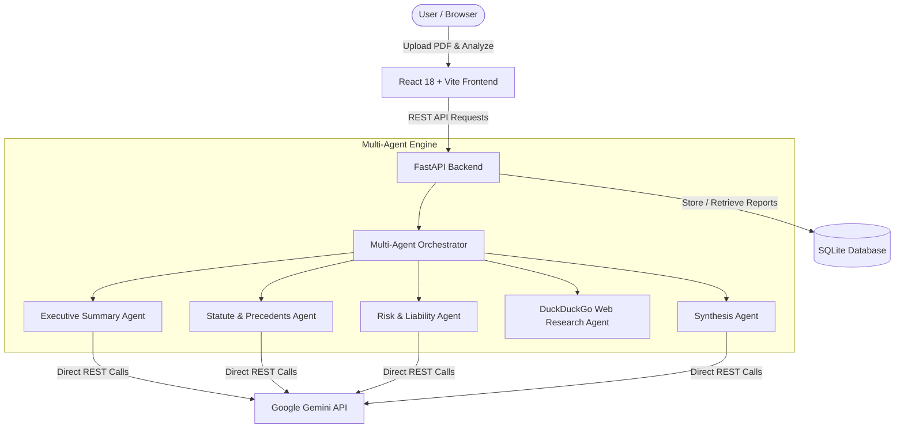

# ⚖️ Judicia – AI-Powered Judicial Insight & Transparency Platform

[](https://judicia-ai-powered-judicial-insight-transparency-oanoq26ca.vercel.app/)
[](https://judicia-backend.onrender.com)
[](https://fastapi.tiangolo.com)
[](https://reactjs.org)
[](https://vitejs.dev)
[](https://www.python.org)

An advanced legal document intelligence platform that parses, summarizes, and extracts key legal insights from complex court judgments using a **5-Agent Multi-Agent Reasoning Pipeline**, **Dynamic Google Gemini AI integration**, and **Real-Time Web Legal Research**.

---

## 🌐 Live Deployments

| Service | Platform | URL |
| :--- | :--- | :--- |
| **Frontend Web App** | Vercel | [https://judicia-ai-powered-judicial-insight-transparency-oanoq26ca.vercel.app/](https://judicia-ai-powered-judicial-insight-transparency-oanoq26ca.vercel.app/) |
| **Backend API** | Render | [https://judicia-backend.onrender.com](https://judicia-backend.onrender.com) |
| **Interactive API Docs** | Swagger UI | [https://judicia-backend.onrender.com/docs](https://judicia-backend.onrender.com/docs) |

---

## 🚀 Key Features

- 📄 **PDF Judgment Extraction**: Seamless upload and parsing of complex, multi-page legal judgments and rulings.
- 🤖 **5-Agent Multi-Agent Reasoning Pipeline**:
  - **Executive Summarizer Agent**: Synthesizes core verdict and case background.
  - **Statute & Precedent Extraction Agent**: Extracts cited Indian Penal Code (IPC/BNS), Constitution articles, and case laws.
  - **Risk & Liability Analysis Agent**: Evaluates legal liabilities, damages, and compliance implications.
  - **Real-Time Web Legal Researcher Agent**: Searches verified legal sources for relevant precedent context.
  - **Synthesis Agent**: Produces structured, actionable, and transparent judicial reports.
- ⚡ **Dynamic Gemini Model Auto-Discovery**: Automatically queries and verifies available Gemini models (e.g. `gemini-2.0-flash`, `gemini-1.5-flash-002`, `gemini-1.5-pro`) with zero-downtime automatic failover.
- 📜 **SQLite Analysis History**: Lightweight, zero-dependency history persistence for previous document analyses.
- 🎨 **Modern Glassmorphic UI**: Built with React, Tailwind CSS, Lucide icons, responsive layout, and dark mode aesthetic.

---

## 🏗️ Architecture



---

## 💻 Local Development Setup

### 📋 Prerequisites
- **Node.js** (v18.x or higher) & **npm**
- **Python** (v3.10 or higher) & **pip**
- **Google Gemini API Key** ([Get free key here](https://aistudio.google.com/app/apikey))

---

### 1️⃣ Clone the Repository

```bash
git clone https://github.com/Abdultaufique/Judicia-AI-powered-judicial-summarizer.git
cd Judicia-AI-powered-judicial-summarizer
```

---

### 2️⃣ Backend Setup (FastAPI)

1. **Create and activate a virtual environment**:
   - **Windows (PowerShell / Command Prompt)**:
     ```bash
     python -m venv venv
     venv\Scripts\activate
     ```
   - **macOS / Linux**:
     ```bash
     python3 -m venv venv
     source venv/bin/activate
     ```

2. **Install Python dependencies**:
   ```bash
   pip install -r requirements.txt
   ```

3. **Configure Environment Variables**:
   Create a `.env` file in the `backend/` directory (or root directory):
   ```env
   GOOGLE_API_KEY=your_actual_google_gemini_api_key_here
   PORT=8000
   ```

4. **Run the Backend Server**:
   ```bash
   cd backend
   uvicorn main:app --reload --host 0.0.0.0 --port 8000
   ```
   > 🚀 The backend will be running at **http://localhost:8000**  
   > 📖 Swagger API Documentation available at **http://localhost:8000/docs**

---

### 3️⃣ Frontend Setup (React + Vite)

1. **Open a new terminal window** and navigate to the frontend directory:
   ```bash
   cd judicial-ai-react
   ```

2. **Install NPM dependencies**:
   ```bash
   npm install
   ```

3. **(Optional) Configure Frontend Environment**:
   Create a `.env` file in `judicial-ai-react/` if connecting to a custom backend:
   ```env
   VITE_API_URL=http://localhost:8000
   ```

4. **Start the Frontend Development Server**:
   ```bash
   npm run dev
   ```
   > 🌐 The application will be accessible at **http://localhost:5173**

---

## 📡 API Endpoints Reference

| Method | Endpoint | Description |
| :--- | :--- | :--- |
| `GET` | `/health` | Health check and model readiness status |
| `POST` | `/analyze` | Upload a PDF judgment file for multi-agent analysis |
| `GET` | `/history` | Fetch list of all previously analyzed legal documents |
| `GET` | `/history/{id}` | Fetch detailed analysis report by record ID |
| `GET` | `/models` | List all discovered & verified Gemini models |

---

## 🛠️ Tech Stack

- **Frontend**: React 18, Vite, Tailwind CSS, Lucide React, Axios
- **Backend**: FastAPI, Uvicorn, PyPDF2, Pydantic, HTTPX
- **AI & Reasoning**: Google Gemini REST API (Dynamic model selection), Multi-Agent Architecture
- **Research & Storage**: DuckDuckGo Search API, SQLite3
- **Deployment**: Vercel (Frontend), Render (Backend)

---

## 📄 License

Distributed under the MIT License. See `LICENSE` for more information.
